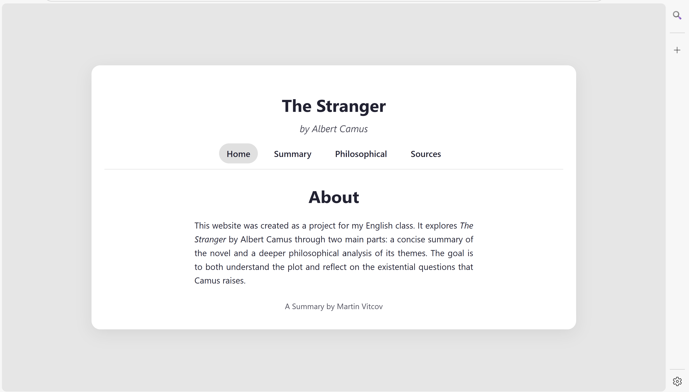

# The Stranger — HTML Literature Project

A small educational website exploring *Albert Camus’* novel **“The Stranger”**, combining literary insight with simple web design.

---

## Components & Structure
```
|- index.html
|- style.css
|- subpages
    |- philosophical.html
    |- sources.html
    |- summary.html
```

- **index.html** – Home page and introduction in to the project
- **style.css** – Stylesheet for layout and design
- **philosophical.html** – Analysis of Camus philosophy of the absurd
- **summary.html** – Summary of the novel
- **sources.html** – References and citations

---

## Preview




---

## 🇬🇧 English

### About the Project
**HTML – The Stranger** is a simple, static website inspired by *Albert Camus’* novel *The Stranger*.  
It was created as an English class project that combines literature and web design fundamentals.  
The goal is to give visitors a clear summary of the story and an accessible look at its philosophical themes.

### Learning Aspect
The project served to enhance my skills in static website development with HTML and CSS and to reinforce my understanding of the novel.

### Technologies
- HTML5  
- CSS3  

### Author
Created by **Martin**

---

## 🇩🇪 Deutsch

### Über das Projekt
**HTML – The Stranger** ist eine simple, statische Website, die auf dem Roman *Der Fremde* von *Albert Camus* basiert.  
Sie wurde als Schulprojekt im Englischunterricht erstellt und verbindet Literatur mit den Grundlagen des Webdesigns.  
Das Ziel ist es, eine verständliche Zusammenfassung der Geschichte und einen Einblick in ihre philosophischen Themen zu bieten.

### Lern Aspekt
Das Projekt trug dazu bei, meine Fähigkeiten in der Entwicklung statischer Webseiten mit HTML und CSS zu verbessern und mein Verständnis des Romans zu festigen.

### Technologien
- HTML5
- CSS3

### Autor
Erstellt von **Martin**


